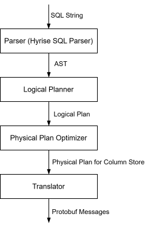
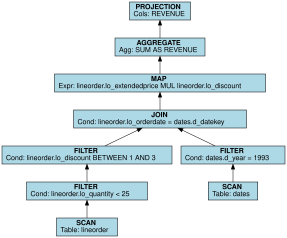
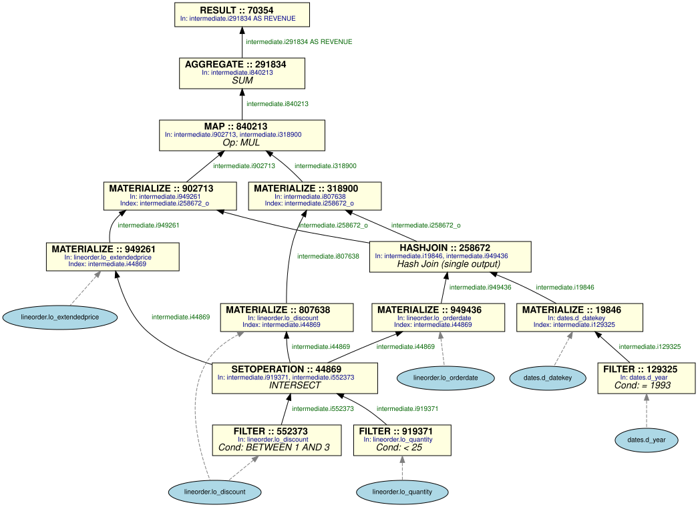
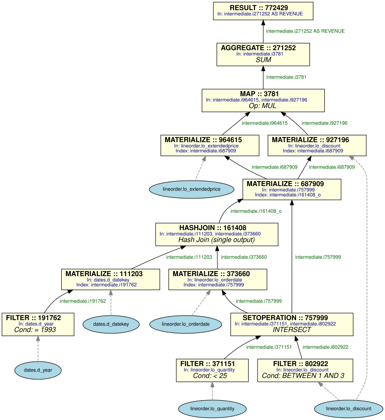
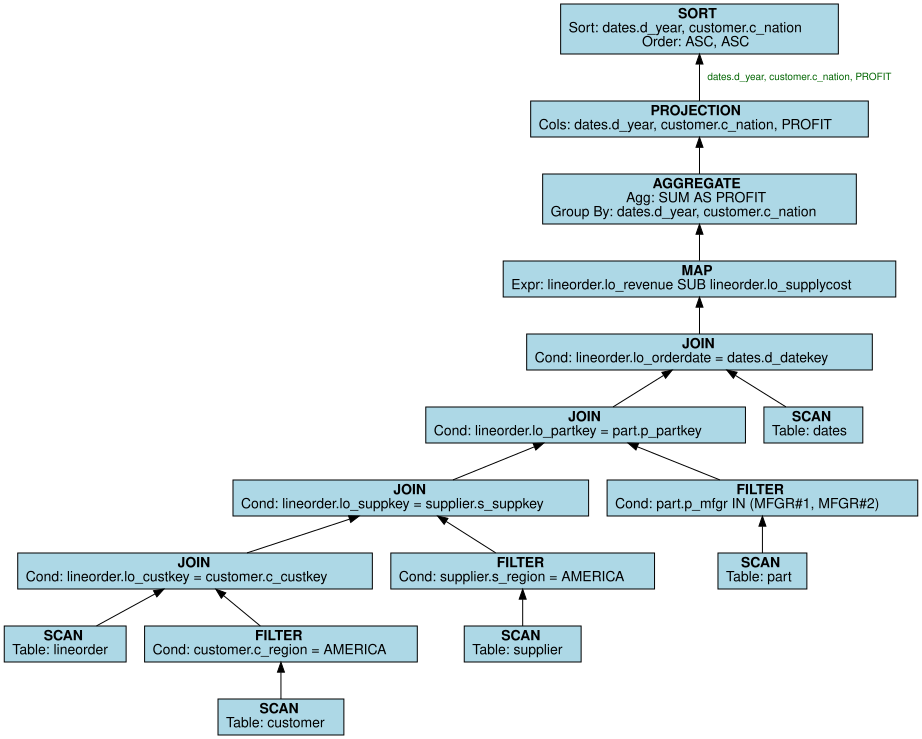
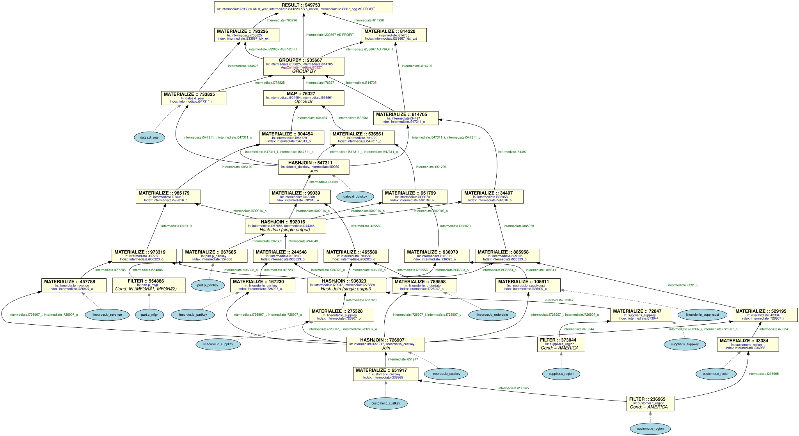
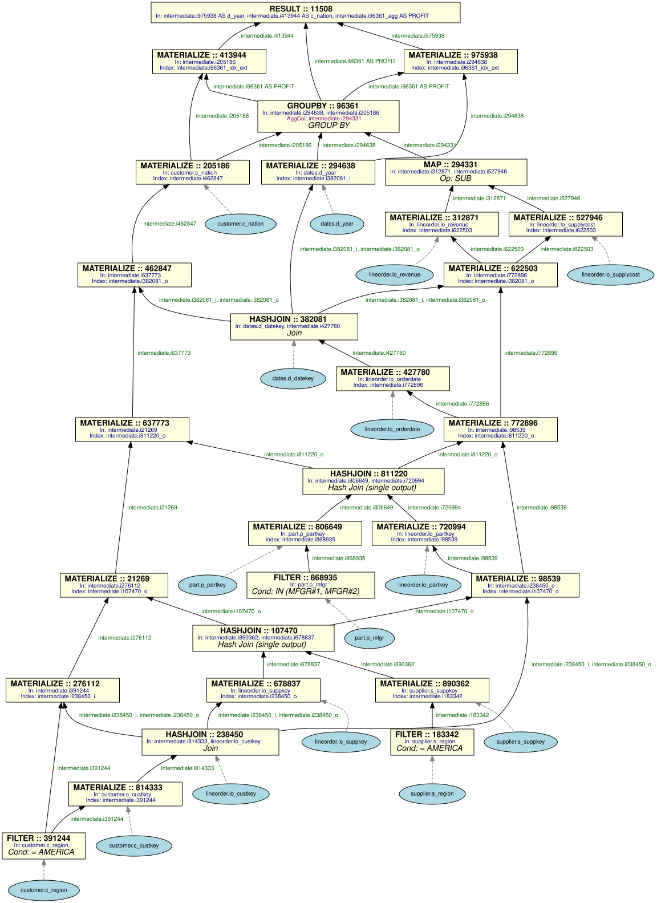

# Physical Optimizer — Developer Documentation

## Table of Contents

1. [Overview](#1-overview)
2. [Architecture at a Glance](#2-architecture-at-a-glance)
3. [Key Concepts](#3-key-concepts)
   - 3.1 [Logical Plan vs. Physical Plan](#31-logical-plan-vs-physical-plan)
   - 3.2 [Position Lists (Poslists)](#32-position-lists-poslists)
   - 3.3 [Materialization](#33-materialization)
   - 3.4 [Intermediate Columns](#34-intermediate-columns)
4. [Walkthrough: SSB Q1.1](#4-walkthrough-ssb-q11)
   - 4.1 [Logical Plan (input)](#41-logical-plan-input)
   - 4.2 [Physical Plan — Chained Mode](#42-physical-plan--chained-mode)
   - 4.3 [What happened?](#43-what-happened)
   - 4.4 [Physical Plan — Optimized Mode](#44-physical-plan--optimized-mode)
   - 4.5 [Debug Console Output (Chained)](#45-debug-console-output-chained)
5. [Walkthrough: SSB Q4.1](#5-walkthrough-ssb-q41)
   - 5.1 [Logical Plan](#51-logical-plan)
   - 5.2 [Physical Plan — Chained Mode](#52-physical-plan--chained-mode-1)
   - 5.3 [The Poslist Chain Explosion](#53-the-poslist-chain-explosion)
   - 5.4 [Physical Plan — Optimized Mode](#54-physical-plan--optimized-mode-1)
   - 5.5 [Single-Output Join Optimization in Q4.1](#55-single-output-join-optimization-in-q41)
6. [Transformation Pipeline](#6-transformation-pipeline)
   - 6.1 [Entry Point and Traversal Strategy](#61-entry-point-and-traversal-strategy)
   - 6.2 [TransformContext — The Shared State](#62-transformcontext--the-shared-state)
   - 6.3 [TransformResult — What Each Handler Returns](#63-transformresult--what-each-handler-returns)
7. [Node Handlers — In Detail](#7-node-handlers--in-detail)
   - 7.1 [SCAN](#71-scan)
   - 7.2 [FILTER](#72-filter)
   - 7.3 [SETOPERATION](#721-setoperation)
   - 7.4 [JOIN (HASHJOIN)](#74-join-hashjoin)
   - 7.5 [MATERIALIZE](#75-materialize)
   - 7.6 [MAP](#76-map)
   - 7.7 [AGGREGATE](#77-aggregate)
   - 7.8 [GROUPBY](#78-groupby)
   - 7.9 [SORT](#79-sort)
   - 7.10 [PROJECTION](#710-projection)
   - 7.11 [RESULT](#711-result)
8. [Materialization Deep-Dive](#8-materialization-deep-dive)
   - 8.1 [The Poslist Chain](#81-the-poslist-chain)
   - 8.2 [Chained Materialization (Real Example)](#82-chained-materialization-real-example)
   - 8.3 [Optimized Materialization (Real Example)](#83-optimized-materialization-real-example)
   - 8.4 [Caching](#84-caching)
   - 8.5 [MaterializedInfo — The Cache Entry](#85-materializedinfo--the-cache-entry)
9. [Post-Processing: Single-Output Join Optimization](#9-post-processing-single-output-join-optimization)
---

## 1. Overview

The **Physical Optimizer** translates a *logical query plan* (a tree of relational
algebra operators like SCAN, FILTER, JOIN, PROJECT) into a *physical query plan*
(a Directed Acyclic Graph (DAG) of concrete execution operators like FILTER, HASHJOIN, MATERIALIZE, MAP,
AGGREGATE). The physical plan is designed for a **column-store** execution engine
where data is stored column-by-column and operations use *position lists* to
identify qualifying rows.

---

## 2. Architecture at a Glance



---

## 3. Key Concepts

### 3.1 Logical Plan vs. Physical Plan

| Aspect          | Logical Plan                          | Physical Plan                          |
|-----------------|---------------------------------------|----------------------------------------|
| Structure       | Tree (each node has ≤ N children)     | DAG (nodes can be shared)              |
| Operators       | SCAN, FILTER, JOIN, MAP, AGGREGATE, PROJECTION, SORT, SETOPERATION | FILTER, HASHJOIN, MATERIALIZE, MAP, AGGREGATE, GROUPBY, SETOPERATION, SORT, RESULT |
| Data references | Table + column names                  | Intermediate column IDs (e.g. `i919371`)   |
| SCAN            | Explicit node                         | Implicit (no physical node needed)     |
| PROJECTION      | Explicit node                         | Folded into the RESULT node            |

### 3.2 Position Lists (Poslists)

A **position list** is the central concept in this column-store engine. It is an
ordered list of row indices that identify which rows from a base table satisfy
some condition.

```
Example: FILTER on lineorder.lo_discount BETWEEN 1 AND 3

lineorder table (e.g., 6M rows)

Poslist output:              [1, 3, 17, 42, 99, ...]
-> These are the row positions where lo_discount is between 1 and 3
```

Position lists flow through the plan and are used for two purposes:

1. **Narrowing**: A JOIN takes two materialized columns and produces two new
   poslists (inner + outer) that map matching rows (more in [Section 7.4](#74-join-hashjoin)).
2. **Materialization**: A MATERIALIZE node uses a poslist to extract actual
   column values from a base table at those positions.

### 3.3 Materialization

**Materialization** is the process of reading actual column values from a base
table using a position list. For instance:

```
MATERIALIZE(column=lineorder.lo_discount, poslist=i552373)

-> Reads lo_discount at the specified rowIDs of the position list and produces a new intermediate column i807638 with the actual values of lo_discount
```

This behaviour is different from row-store databases: instead of passing full rows
through operators, we pass position lists and only read column values when
actually needed.

### 3.4 Intermediate Columns

Every physical operator that produces output gives it a unique **intermediate
column name** in the form `i<random_id>` (e.g. `i919371`, `i258672`). These
columns logically belong to an `intermediate` table. The IDs are randomly
generated and will differ between runs.

Suffixes on intermediate names carry meaning:

| Suffix     | Meaning                                          | Example |
|------------|--------------------------------------------------|---------|
| `_i`       | Inner poslist from a HASHJOIN                    | `i258672_i` |
| `_o`       | Outer poslist from a HASHJOIN                    | `i258672_o` |
| `_idx`     | Unique group indices from GROUPBY (or sort index)| `i233667_idx` |
| `_idx_ext` | Extended indices for rematerializing grouped keys| `i233667_idx_ext` |
| `_cluster` | Cluster assignment from GROUPBY                 | `i233667_cluster` |
| `_agg`     | Aggregation result column                        | `i96361_agg` |

---

## 4. Walkthrough: SSB Q1.1

Let's trace through a complete example using Star Schema Benchmark query 1.1.
This is the simplest SSB query: 2 tables, 1 join, 2 filters on lineorder,
1 filter on dates, a MAP, and an AGGREGATE.

> **Note:** All intermediate IDs shown below come from an actual run. IDs are
> randomly generated and will differ between runs, but the structure is always
> the same.

```sql
SELECT SUM(lo_extendedprice * lo_discount) AS REVENUE
FROM lineorder, dates
WHERE lo_orderdate = d_datekey
  AND d_year = 1993
  AND lo_discount BETWEEN 1 AND 3
  AND lo_quantity < 25;
```

### 4.1 Logical Plan (input)

The logical planner produces a tree like this (read bottom-up):



### 4.2 Physical Plan — Chained Mode

Running with `-optimize 0` (chained materialization), the optimizer produces
this physical DAG. The node IDs are from an actual run:



### 4.3 What happened?

1. **SCANs disappeared** — they are implicit in filter / join nodes.
2. **Two FILTERs on lineorder** (`lo_quantity < 25` → `i919371`, `lo_discount BETWEEN 1 AND 3` → `i552373`) merged via **SETOPERATION (INTERSECTION)** → poslist `i44869`.
3. **One FILTER on dates** (`d_year = 1993`) → poslist `i129325`.
4. **Join keys materialized**: `d_datekey` through `i129325` → `i19846`; `lo_orderdate` through `i44869` → `i949436`.
5. **HASHJOIN** produced two poslists: `i258672_i` (dates/inner side) and `i258672_o` (lineorder/outer side). Later optimized to **single-output mode** because only `i258672_o` is consumed downstream (the join remains a HASHJOIN but only produces the needed poslist).
6. **Lineorder poslist chain** is now `[i44869, i258672_o]` — two steps of narrowing.
7. **MAP inputs materialized** through the chain in two steps each:
   - `lo_extendedprice`: MATERIALIZE(base, poslist=`i44869`) → `i949261` → MATERIALIZE(`i949261`, poslist=`i258672_o`) → `i902713`
   - `lo_discount`: MATERIALIZE(base, poslist=`i44869`) → `i807638` → MATERIALIZE(`i807638`, poslist=`i258672_o`) → `i318900`
8. **MAP(MUL)** of `i902713 * i318900` → `i840213`.
9. **AGGREGATE(SUM)** of `i840213` → `i291834` aliased as `REVENUE`.
10. **RESULT** wraps everything.

### 4.4 Physical Plan — Optimized Mode

Running with `-optimize 1`, the key difference is in materialization. Instead
of chaining the materializations of e.g., `lo_discount` through each poslist step-by-step, to get the correct entries of all values that remained after joins and filters on the lineorder table, the optimizer **composes all relevant
poslists on the lineorder table first** (via a materialization of two position lists), then materializes the base columns once on the resulting position list:



**Compare the two strategies for `lo_extendedprice`:**

| Strategy | Steps | MATERIALIZE nodes |
|----------|-------|-------------------|
| Chained  | `lo_discount → materialize on SETOPERATION → i949261 → materialize on outer poslist from join → i902713` (analogical for lo_extendedprice) | 2 |
| Optimized | `compose latest poslists from lineorder table via materialization i757999 + i161408_o → i687909`, then materialize the respective base column directly on that result e.g., `lo_discount → i927196` | 1 |

The optimized strategy reads each
base column value exactly **once** instead of copying intermediates through
each chain step. The real benefit shows in more complex queries like Q4.1 where chains grow to >4 steps.

### 4.5 Single-Output Join Optimization in Q1.1

Since only the outer position list column of the join of `lo_orderdate` and `dates.d_datekey` is needed in subsequent operations, the HASHJOIN can be optimized to only produce that single output poslist. The node remains a HASHJOIN (the operator is functionally unchanged), but its `result_columns` are trimmed to the single consumed poslist, signalling the executor to skip allocating and writing the unused output. This is implemented by a post-processing pass. For more details see [Section 9](#9-post-processing-single-output-join-optimization).

## 5. Walkthrough: SSB Q4.1

```sql
SELECT d_year, c_nation,
       SUM(lo_revenue - lo_supplycost) AS PROFIT
FROM dates, customer, supplier, part, lineorder
WHERE lo_custkey = c_custkey
  AND lo_suppkey = s_suppkey
  AND lo_partkey = p_partkey
  AND lo_orderdate = d_datekey
  AND c_region = 'AMERICA'
  AND s_region = 'AMERICA'
  AND (p_mfgr = 'MFGR#1' OR p_mfgr = 'MFGR#2')
GROUP BY d_year, c_nation
ORDER BY d_year, c_nation;
```

### 5.1 Logical Plan



### 5.2 Physical Plan — Chained Mode

Here is the actual physical plan from a run with `-optimize 0`:



**Filters:**

| Table    | Condition                        | Poslist  |
|----------|----------------------------------|----------|
| customer | `c_region = 'AMERICA'`           | `i236965`|
| supplier | `s_region = 'AMERICA'`           | `i373044`|
| part     | `p_mfgr IN ('MFGR#1','MFGR#2')` | `i554886`|

**Joins (processed bottom-up):**

| # | Join                       | Inner (builds hash) | Outer (probes) | Output poslists |
|---|----------------------------|---------------------|----------------|-----------------|
| 1 | `lo_custkey = c_custkey`   | customer (30K rows) | lineorder (6M) | `i726907_i`, `i726907_o` |
| 2 | `lo_suppkey = s_suppkey`   | supplier (2K rows)  | lineorder      | `i936323_o` (single output) |
| 3 | `lo_partkey = p_partkey`   | part (200K rows)    | lineorder      | `i592016_o` (single output) |
| 4 | `lo_orderdate = d_datekey` | dates (2.5K rows)   | lineorder      | `i547311_i`, `i547311_o` |

**Lineorder's poslist chain after all 4 joins:** `[i726907_o, i936323_o, i592016_o, i547311_o]`

This means any lineorder column needs **4 MATERIALIZE steps** in chained mode.

**Materialization of `lo_revenue` (4 steps):**

```
MATERIALIZE(lo_revenue,  poslist=i726907_o) → i457788  [chain step 0]
MATERIALIZE(i457788,     poslist=i936323_o) → i973319  [chain step 1]
MATERIALIZE(i973319,     poslist=i592016_o) → i985179  [chain step 2]
MATERIALIZE(i985179,     poslist=i547311_o) → i904454  [chain step 3]  ← final value
```

**Materialization of `customer.c_nation` (5 steps):**

Customer's poslist chain is `[i236965, i726907_i, i936323_o, i592016_o, i547311_o]`.
After the customer→lineorder join, customer data is "aligned" with lineorder
rows (via the `_i` inner poslist), so subsequent lineorder-side joins (`_o`
poslists) further narrow the customer-aligned data.

```
MATERIALIZE(c_nation,    poslist=i236965)   → i43384   [chain step 0: customer filter]
MATERIALIZE(i43384,      poslist=i726907_i) → i529195  [chain step 1: cust-LO join inner]
MATERIALIZE(i529195,     poslist=i936323_o) → i885958  [chain step 2: supplier semi]
MATERIALIZE(i885958,     poslist=i592016_o) → i34497   [chain step 3: part semi]
MATERIALIZE(i34497,      poslist=i547311_o) → i814705  [chain step 4: dates join]
```

**GROUPBY and SORT:**

The SORT node is **elided** because the ORDER BY columns (`d_year, c_nation`)
exactly match the GROUP BY columns. The GROUPBY output is already ordered.

**Post-GROUPBY rematerialization:**

The GROUP BY produces one row per distinct `(d_year, c_nation)` group. The
grouped key values must be re-extracted using the `_idx_ext` poslist:

```
MATERIALIZE(i733825,  poslist=i233667_idx_ext) → i793226  ← d_year (grouped)
MATERIALIZE(i814705,  poslist=i233667_idx_ext) → i814220  ← c_nation (grouped)
```

**RESULT :: 949753** In: `i793226 AS d_year`, `i814220 AS c_nation`, `i233667_agg AS PROFIT`

### 5.3 The Poslist Chain Explosion

The chained strategy's cost grows linearly with the number of joins. For Q4.1:

| Column | Table | Chain length | MATERIALIZE nodes |
|--------|-------|-------------|-------------------|
| `lo_revenue` | lineorder | 4 | 4 |
| `lo_supplycost` | lineorder | 4 | 4 |
| `lo_orderdate` | lineorder | 3 (at time of use) | 3 |
| `lo_suppkey` | lineorder | 1 (at time of use) | 1 |
| `lo_partkey` | lineorder | 2 (at time of use) | 2 |
| `c_nation` | customer | 5 | 5 |
| `d_year` | dates | 1 | 1 |

Lineorder columns used later in the plan must traverse longer chains because
new join poslists keep appending. The **optimized strategy** eliminates this
growth (see below).

### 5.4 Physical Plan — Optimized Mode

With `-optimize 1`, the optimizer **composes poslist chains** in a materialization before
materializing base columns, so each base column is read exactly once. For a more detailed analysis on how this works see [Section 4.4](#44-physical-plan--optimized-mode). The result is a physical plan with significantly less nodes:



### 5.5 Single-Output Join Optimization in Q4.1

Behaves in the same way as described in [Section 4.5](#45-single-output-join-optimization-in-q11).

## 6. Transformation Pipeline

### 6.1 Entry Point and Traversal Strategy

The optimizer uses a **post-order (bottom-up) traversal** of the logical plan
tree. This means children are processed before their parent. The reason is
simple: when processing a JOIN, we need to know what position lists the FILTER
children produced. When processing an AGGREGATE, we need to know what the MAP
or JOIN below it produced.

After the full transformation, a post-processing pass optimizes eligible
HASHJOIN nodes to single-output mode (see [Section 9](#9-post-processing-single-output-join-optimization)).

### 6.2 TransformContext — The Shared State

The `TransformContext` struct is the mutable state that flows through
the entire transformation. It accumulates information as nodes are processed
bottom-up. Note that this list is not complete and only includes the fields that are important for the general understanding:

| Field                   | Type | Purpose                                                                 |
|-------------------------|------|-------------------------------------------------------------------------|
| `table_poslist_chain`   | `map<string, vector<Column>>` | For each table, the ordered list of position lists that narrow its rows. |
| `materialized_columns`  | `map<string, MaterializedInfo>` | Cache: avoids re-materializing the same `table.column` twice. Keyed by `"table.column"`. |
| `intermediate_results`  | `map<string, MaterializedInfo>` | Maps names/aliases (e.g. `"REVENUE"`) to their `MaterializedInfo`.      |
| `poslist_provenance`    | `map<string, string>` | Maps each poslist column name (e.g. `"i44869"`) to its source table.       |
| `filter_nodes`          | `map<string, shared_ptr<PhysicalPlanNode>>` | Maps `"tablename_filter"` to the physical node producing that filter.   |
| `available_poslists`    | `map<string, Column>` | Maps `"tablename_filter"` to the poslist column produced.               |
| `projected_columns`     | `vector<Column>` | The final projected columns (filled by PROJECTION handler).             |
| `limit_count/offset`    | `int` | LIMIT/OFFSET values extracted early and applied to the RESULT node.     |

**Concrete state snapshot — Q1.1 after processing the join:**

```
table_poslist_chain:
  "lineorder" → [ Column("i44869"),       ← SETOPERATION (combined filters)
                   Column("i258672_o") ]   ← HASHJOIN outer
  "dates"     → [ Column("i129325") ]     ← FILTER on d_year

poslist_provenance:
  "i919371"   → "lineorder"   (lo_quantity filter)
  "i552373"   → "lineorder"   (lo_discount filter)
  "i44869"    → "lineorder"   (SETOPERATION intersection)
  "i129325"   → "dates"       (d_year filter)
  "i258672_o" → "lineorder"   (join outer)
  "i258672_i" → "dates"       (join inner)

materialized_columns:
  "dates.d_datekey"        → { column: i19846,   chain_index: 0 }
  "lineorder.lo_orderdate" → { column: i949436,  chain_index: 0 }
  (join keys were materialized to build the HASHJOIN)
```

Get a deeper understanding how this shared state is used in [Section 8.4](#84-caching).

### 6.3 TransformResult — What Each Handler Returns

Every handler returns a `TransformResult` containing:

- **`physical_root`**: The root `PhysicalPlanNode` of the subtree just built.
- **`output_column`**: The primary output column (poslist or materialized value).
- **`secondary_output`**: For JOINs, the second poslist (outer side).
- **`source_table`**: The primary table this subtree operates on.
- **`tables_involved`**: All tables reachable from this subtree.
- **`result_type`**: Classification (SCAN, POSLIST, JOINED, MATERIALIZED, AGGREGATE, GROUPBY).

---

## 7. Node Handlers — In Detail

### 7.1 SCAN

**Logical**: `SCAN [lineorder]`
**Physical**: *Nothing.* SCANs are implicit in a column store.

The handler simply records the table name in the result. No physical node is
created. Downstream operators (FILTER, MATERIALIZE) access the base table
columns directly.

### 7.2 FILTER

**Logical**: `FILTER [lo_discount BETWEEN 1 AND 3]`
**Physical**: `FILTER` node producing a position list.

```
Input:  base column (e.g. lineorder.lo_discount, marked is_base=true)
Output: poslist column (e.g. intermediate.i552373)
```

**Three special cases:**

1. **Same-table stacking**: If two FILTERs on the same table are stacked
   (e.g. `lo_discount BETWEEN 1 AND 3` on top of `lo_quantity < 25`), the
   handler automatically creates a SETOPERATION(INTERSECTION) to combine
   the two position lists.

2. **Cross-table filter**: If a FILTER references columns from two different
   tables (e.g. a post-join condition), it becomes a `handleCrossTableFilter`
   which materializes both columns first, then filters on the materialized
   values.

3. **Single filter**: The most common case. It creates one FILTER node and
   registers the poslist in the context.

After creating a filter, the poslist is appended to `table_poslist_chain[table]`,
making it available for subsequent materialization.

### 7.2.1 SETOPERATION

**Logical**: `SETOPERATION [INTERSECTION]` (from `AND` in WHERE clause)
**Physical**: `SETOPERATION` node combining two or more position lists.

```
Input:  2+ poslist columns (e.g. i919371, i552373)
Output: combined poslist column (e.g. i44869)
Type:   INTERSECTION (AND), UNION (OR), or NEGATION (NOT)
```

When a SETOPERATION is created, it **replaces** the individual filter chains
for the source table. This ensures that downstream MATERIALIZE nodes use the
combined poslist rather than an individual filter's poslist.

Before SETOP: `lineorder chain = [i919371, i552373]`
After SETOP:  `lineorder chain = [i44869]`

### 7.4 JOIN (HASHJOIN)

**Logical**: `JOIN [lo_orderdate = d_datekey]`
**Physical**: `HASHJOIN` node.

The handler:

1. Processes both children (left and right subtrees).
2. Materializes join key columns through the poslist chain (e.g. `d_datekey`
   through its filter poslist, `lo_orderdate` through lineorder's combined
   filter poslist).
3. Creates a HASHJOIN node with the materialized keys as inputs.
4. Produces **two output position lists**: `i<id>_i` (inner) and `i<id>_o` (outer).
5. Appends these poslists to the chains of **all tables** in the respective
   subtrees.

**Inner/Outer swap**: The smaller table (by hard-coded SSB cardinality) is
placed on the inner side of the hash join for better performance. The inner
table is used to build the hash table.

### 7.5 MATERIALIZE

MATERIALIZE is not a logical operator. It is **only** a physical operator.
It is created on-demand by `ensureMaterialized()` whenever an operator needs
actual column values rather than position lists.

```
Input:  base_column (e.g. lineorder.lo_discount)  +  poslist (e.g. i44869)
Output: intermediate column with concrete values   (e.g. i807638)
```

Think of it as: "Read column values at the positions specified by the poslist."

See [Section 8](#8-materialization-deep-dive) for how `ensureMaterialized()`
decides whether to chain or compose.

### 7.6 MAP

**Logical**: `MAP [lo_extendedprice * lo_discount]`
**Physical**: `MAP` node performing arithmetic.

```
Input:  2+ materialized intermediate columns (e.g. i902713, i318900)
Output: computed intermediate column (e.g. i840213)
```

The handler materializes all input columns through `ensureMaterialized()`, then
creates a MAP node that applies the arithmetic operation (ADD, SUB, MUL, DIV,
MOD).

### 7.7 AGGREGATE

**Logical**: `AGGREGATE [SUM(i840213)]`
**Physical**: `AGGREGATE` node.

Handles two scenarios:

1. **With GROUP BY** → dispatches to `handleGroupBy` (see [7.8](#78-groupby)).
2. **Without GROUP BY**:
   - **Single aggregation** (e.g. `SUM(x)`) → one AGGREGATE node.
   - **Multiple aggregations** (e.g. `SUM(x), COUNT(*)`) → one AGGREGATE node
     per spec, enabling parallel execution.

### 7.8 GROUPBY

**Logical**: `AGGREGATE [GROUP BY d_year, c_nation; SUM(lo_revenue - lo_supplycost)]`
**Physical**: `GROUPBY` node + optional `AGGREGATE` nodes.

The GROUPBY handler:

1. Materializes group-by key columns.
2. Creates a GROUPBY node with auxiliary output columns:
   - `_idx`
   - `_idx_ext`
   - `_cluster`
3. For **single aggregation**: includes the aggregation directly in the GROUPBY
   node via its `aggregationColumn`.
4. For **multiple aggregations**: creates separate AGGREGATE nodes (one per
   agg spec) that reference the GROUPBY's `_idx` and `_cluster` columns.
   These can execute in parallel.
5. Re-materializes group-by keys using the `_idx_ext` poslist so that downstream
   PROJECTION sees the grouped versions.

**Real example from Q4.1:**
```
GROUPBY :: 233667
  Input keys: i733825 (d_year), i814705 (c_nation)
  AggCol:     i76327 (lo_revenue - lo_supplycost)
  Outputs:    i233667_idx      
              i233667_idx_ext
              i233667_cluster  
              i233667_agg      

Post-GROUPBY rematerialization:
  MATERIALIZE(i733825, poslist=i233667_idx_ext) → i793226  [d_year per group]
  MATERIALIZE(i814705, poslist=i233667_idx_ext) → i814220  [c_nation per group]
```

These rematerialized columns (`i793226`, `i814220`) are stored with
`chain_index = 9999` (sentinel) so they are never invalidated by chain growth.

### 7.9 SORT

**Logical**: `SORT [d_year ASC, c_nation ASC]`
**Physical**: `SORT` node producing a sorted position list.

```
Input:  materialized columns to sort by
Output: sorted poslist (e.g. i<id>_idx)
```

**GROUPBY elision**: If the SORT columns exactly match the preceding GROUPBY's
key columns, the SORT is skipped entirely (the GROUPBY output is already in the
desired order). This happens in Q4.1:

```
[DEBUG:handleSort] SORT elided: columns match preceding GROUPBY keys
```

**Aggregate references**: `ORDER BY COUNT(*)` is resolved by looking up the
GROUPBY node's cluster result column.

### 7.10 PROJECTION

**Logical**: `PROJECTION [d_year, c_nation, PROFIT]`
**Physical**: *No dedicated node.* Folded into RESULT.

The handler materializes each projected column through `ensureMaterialized()`,
preserves column aliases, and stores the results in `context.projected_columns`.
The actual output is built by the RESULT node.

For Q4.1, PROJECTION looks up `d_year`, `c_nation`, and `PROFIT` from
`context.intermediate_results`. These were stored by the GROUPBY handler by checking if the grouped columns are also projected columns.
Because they were already materialized (re-materialization of grouped columns) with `chain_index = 9999`, the cache
returns them immediately (no new MATERIALIZE nodes created).

### 7.11 RESULT

The RESULT node is the **root** of the physical plan. It is built by
`buildResultNode()` after the full traversal completes.

```
node_type:      RESULT
base_columns:   the projected columns (materialized intermediates)
result_columns: same columns with display aliases
resultName:     "result" or "result_<table>"
index:          (optional) sorted poslist from a SORT node
expression:     carries LIMIT/OFFSET if present
children:       all producer nodes (SORT, MATERIALIZE, AGGREGATE, etc.)
```

**Q1.1 RESULT:**
```
RESULT :: 70354
  In: i291834 AS REVENUE
  Children: AGGREGATE :: 291834, MAP :: 840213, ...
```

**Q4.1 RESULT:**
```
RESULT :: 949753
  In: i793226 AS d_year, i814220 AS c_nation, i233667_agg AS PROFIT
  Children: MATERIALIZE :: 793226, MATERIALIZE :: 814220, GROUPBY :: 233667, ...
```

**Sorted vs. unsorted**: If the plan includes a SORT node, the RESULT
uses its output poslist as an `index` to read projected columns in sorted
order. Producer nodes are deduplicated to avoid adding the same child twice.

---

## 8. Materialization Deep-Dive

### 8.1 The Poslist Chain

For each base table, the context maintains an ordered **poslist chain**. Each
step in the chain further narrows the set of qualifying rows:

```
Q1.1 lineorder's chain after processing:
  [0] i44869    : rows matching lo_discount BETWEEN 1..3 AND lo_quantity < 25 (SETOPERATION)
  [1] i258672_o : subset of those rows that also match the join condition

Q4.1 — lineorder's chain after all 4 joins:
  [0] i726907_o : customer join (outer)
  [1] i936323_o : supplier join, single output (outer)
  [2] i592016_o : part join, single output (outer)
  [3] i547311_o : dates join (outer)
```

When we need to read `lineorder.lo_revenue`, we must materialize through
this entire chain.

### 8.2 Chained Materialization (Real Example)

The **chained** strategy (used when `optimize_chains = false`) materializes
step-by-step through each poslist in the chain.

**Q4.1 `lo_revenue` — 4 chain steps:**

```
Materializing lineorder.lo_revenue through chain of length 4
MATERIALIZE lo_revenue   poslist=i726907_o → i457788  [step 0]
MATERIALIZE i457788      poslist=i936323_o → i973319  [step 1]
MATERIALIZE i973319      poslist=i592016_o → i985179  [step 2]
MATERIALIZE i985179      poslist=i547311_o → i904454  [step 3]

Cached lineorder.lo_revenue → i904454 (chain_index=3)
```

Each step produces an intermediate column that feeds into the next. The final
result (`i904454`) has values only for rows that survived ALL four joins.

### 8.3 Optimized Materialization (Real Example)

The **optimized** strategy (used when `optimize_chains = true`) composes the
poslist chain into a single poslist first, then materializes the base column
once.

**Q4.1 `lo_revenue` — poslist composition then one-shot read:**

```
Composing poslist chain for lineorder (length 4)
MATERIALIZE i238450_o  index=i107470_o → i98539     [compose step 1]
MATERIALIZE i98539     index=i811220_o → i772896    [compose step 2]
MATERIALIZE i772896    index=i382081_o → i622503    [compose step 3]
MATERIALIZE lo_revenue poslist=i622503 → i312871    [one-shot]
```

The first three MATERIALIZE nodes apply poslist-to-poslist composition
(indicated by the `index=` parameter). Only the final one reads actual base
column values (indicated by `poslist=`). The composed poslist `i622503` is
**shared**. For instance, `lo_supplycost` also uses it:

```
MATERIALIZE lo_supplycost poslist=i622503 → i527946  [one-shot, reusing composed poslist]
```


### 8.4 Caching

Both strategies cache their results in `context.materialized_columns` keyed by
`"table.column"` (e.g. `"lineorder.lo_discount"`). The cache distinguishes
between:

- **Base-table chain materializations**: Tied to a specific `chain_index`. If
  the chain grows (e.g. after a new join), the cached entry becomes stale and
  is re-materialized.
- **Derived values** (e.g. rematerialized GROUPBY keys): Stored with
  `chain_index = 9999` (sentinel). Always reused regardless of chain changes.

**Example: Q4.1 stale cache invalidation (chained mode)**

In Q4.1, `lo_orderdate` is only ever needed once: as the join key for the
dates join, which is the **4th and final join**. By that time, lineorder's
poslist chain already has 3 entries from the 3 prior joins (stored in TransformContext):

```
chain["lineorder"] = [i726907_o, i936323_o, i592016_o]  → size = 3
```

Since there is **no prior cached entry** for `lo_orderdate`, there is no
staleness to detect. It is materialized through all 3 chain steps in one
pass (producing intermediates at steps 0, 1, 2), then used as the join key.
After the dates join appends `i547311_o`, the chain grows to size 4 but
`lo_orderdate` is never requested again, so the cache entry is never
re-checked. 

However, if it were requested again at some later point in time, for instance the
chain on lineorder has grown to size 6, there would be a cached entry in
`context.materialized_columns` for the key `"lineorder.lo_orderdate"` with
`chain_index = 2` (the step it was last materialized through). The staleness
check compares `chain_index` against `chain.size() - 1`:

```
cached chain_index: 2
current chain size: 6  →  chain.size() - 1 = 5

Staleness check:  2 >= 5  →  false  →  STALE!
```

The cache entry is stale because the chain grew from 3 to 6 since the last
materialization. To fix this, `ensureMaterialized()` resumes materializing
from `chain_index + 1 = 3` onwards. It takes the previously cached
intermediate column and chains it through steps 3, 4, and 5 to produce an
up-to-date result. The cache entry is then updated to `chain_index = 5`.

If instead the chain had **not** grown (still size 3), the check would be:

```
cached chain_index: 2
current chain size: 3  →  chain.size() - 1 = 2

Staleness check:  2 >= 2  →  true  →  VALID (cache hit)
```

The cached intermediate is returned directly. No new MATERIALIZE nodes needed.

### 8.5 MaterializedInfo — The Cache Entry

Each entry in the materialization cache is a `MaterializedInfo` struct:

```cpp
struct MaterializedInfo {
    Column column;           // The intermediate column (e.g. i904454)
    int chain_index;         // Which chain step this was materialized at
    std::shared_ptr<PhysicalPlanNode> node;  // The MATERIALIZE node that produced it
    bool is_base_table_chain_materialization; // True for base-table materializations
};
```

**`chain_index` semantics:**

| Value | Meaning | Example |
|-------|---------|---------|
| 0, 1, 2, ... | Materialized through chain step N | `lo_revenue` at step 0 → chain_index=0 |
| -1 | Never materialized (derived/aggregated) | MAP results, AGGREGATE results |
| 9999 | Sentinel: never invalidated | GROUPBY rematerialized keys |

When `ensureMaterialized()` finds a cached entry:
- If `chain_index < current_chain_length - 1`, the cache is stale. Continue
  materializing from `chain_index + 1` onwards.
- If `chain_index >= current_chain_length - 1`, the cache is valid. Return it.
- If `chain_index == 9999`, always valid (derived value).

## 9. Post-Processing: Single-Output Join Optimization

After the full plan is built, a post-processing pass scans the DAG for HASHJOIN
nodes where only one of the two output position lists is actually consumed
downstream.

A HASHJOIN always produces two position lists: inner (`_i`) and outer (`_o`).
If only one of them is actually consumed by any downstream node, the HASHJOIN's
`result_columns` are trimmed to just the needed poslist. The node remains a
HASHJOIN such that the operator is functionally unchanged but the executor can skip
allocating and writing the unused output, saving memory and compute.

> **Why not convert to SEMIJOIN?** A true SEMIJOIN only produces correct results
> when one of the join columns has all-unique values (e.g. a PK-FK relationship).
> If both columns contain duplicates, the multiplicity matters and a SEMIJOIN
> would yield wrong results. The single-output optimization avoids this pitfall:
> the join logic stays identical, only the output is trimmed.

**Algorithm:**

1. **Collect**: Walk the entire DAG and collect all column references that are
   *consumed* (appear in `base_columns`, `index`, `aggregationColumn`, or
   `clusterColumn` of any node). Note: `result_columns` are *produced*, not
   consumed.
2. **Optimize**: For each HASHJOIN with two result columns, check which are
   consumed. If only one is referenced, trim `result_columns` to that single
   poslist.

**Real example — Q1.1:**

The HASHJOIN for `lo_orderdate = d_datekey` produces `[i258672_i, i258672_o]`.
Only `i258672_o` (lineorder side) appears in downstream MATERIALIZE nodes'
`index` fields. The dates-side `i258672_i` is never consumed.